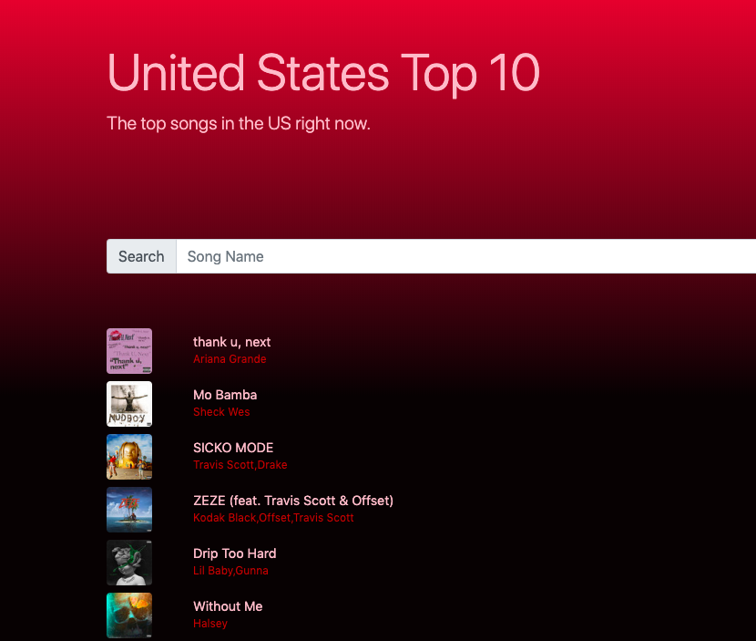

# The Spotify Remake
Using HTML and Javascript this application was used to hold the top songs in the United States based off of Spotify's Top 10 Songs. 

## Features 
- When user begins to type something into the input field, filter the playlist to include only the songs that contain the characters user typed and display in the playlist those songs ONLY. 

- When user clears the input field, show all the songs again.

